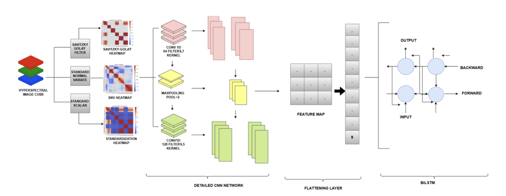

# Non-Destructive Grape Quality Assessment using Hyperspectral Imaging (HSI) and CNN-BiLSTM

## Overview

This project focuses on developing a non-destructive quality assessment system for grapes using Hyperspectral Imaging (HSI) combined with a hybrid deep-learning architecture (CNN-BiLSTM). The work involves capturing spectral signatures of Dilkhush grapes across 204 narrow wavelength bands (400–1000 nm), preprocessing the spectral data, and predicting key enological attributes such as Total Soluble Solids (TSS), pH, Titratable Acidity, and Water Content. The system also supports binary classification of grape quality (Good vs. Bad).

The dataset contains 611 hyperspectral image cubes captured using the Specim IQ VNIR camera. A three-stage preprocessing pipeline (Savitzky–Golay smoothing, Standard Normal Variate normalization, and Standardization) is applied before feeding data into a CNN-BiLSTM model. The proposed architecture demonstrates significant improvements over standalone CNN approaches.

---

## Table of Contents

1. [Dataset Summary](#dataset-summary)  
2. [Experimental Setup & Hardware](#experimental-setup--hardware)  
3. [Preprocessing Pipeline](#preprocessing-pipeline)  
4. [Model Architecture](#model-architecture)  
5. [Training Configuration](#training-configuration)  
6. [Results & Evaluation](#results--evaluation)  
7. [Dataset Organization](#dataset-organization)  
8. [Limitations & Future Work](#limitations--future-work)

---

## Dataset Summary

- **Total Samples:** 611 hyperspectral image cubes  
- **Classes:**  
  - Good (Fresh): 327 samples  
  - Bad (Stored for 2 weeks): 284 samples  
- **Spectral Range:** 400–1000 nm (VNIR)  
- **Bands:** 204 spectral bands  
- **Resolution:** ~512×512 pixels  
- **Environmental Conditions:**  
  - Temperature: ~24±1 °C  
  - Humidity: ~45±5% RH  
  - No ambient light leakage  
- **Camera Distance:** Fixed at 45 cm  
- **Integration Time:** Fixed at 5 ms  

---

## Experimental Setup & Hardware

### Hyperspectral Camera

- **Model:** Specim IQ  
- **Range:** 400–1000 nm  
- **Bands:** 204  
- **Data Output:** Hyperspectral cube + RGB preview  
- **Key Strength:** Portable, consistent calibration, real-time visualization

  

---

### Lighting & Imaging Arrangement

Two tungsten-halogen studio lamps were used to ensure uniform illumination without spectral distortions. The camera was mounted on a tripod at a fixed height, while grapes were placed on a non-reflective board marked for consistent positioning.

  
  

---

## Preprocessing Pipeline

Each hyperspectral cube is converted into a mean reflectance spectrum (204 bands) and processed through the following stages:

### **1. Savitzky–Golay Filter**
- Window Length: 11  
- Polynomial Order: 2  
- Removes high-frequency noise while preserving spectral peaks.

### **2. Standard Normal Variate (SNV)**
- Corrects scatter effects  
- Removes baseline variations  
- Normalizes each spectrum individually  

### **3. Standardization (Z-Score)**
- Ensures zero mean and unit variance across all bands  
- Prepares input for deep-learning models  

  

---

## Model Architecture

The system uses a **hybrid CNN-BiLSTM** model to capture both local spectral patterns and long-range wavelength dependencies.

### **Architecture Breakdown**

1. **Input:** 204-band spectral vector  
2. **CNN Block 1:**  
   - Conv1D (64 filters, kernel size 7, ReLU)  
   - MaxPool1D (pool size 2)  

3. **CNN Block 2:**  
   - Conv1D (128 filters, kernel size 5, ReLU)  
   - MaxPool1D (pool size 2)  

4. **BiLSTM Layer:**  
   - Bidirectional LSTM capturing forward and backward spectral dependencies  

5. **Dense Layers:**  
   - Dense(64) + Dropout(0.3)  
   - Output nodes for regression (TSS, pH, TA, Water Content)  
   - Output node for classification  

  

### Activation Visualizations

Deep feature extraction across layers:

  

---

## Training Configuration

- **Optimizer:** Adam  
- **Learning Rate:** 0.0001  
- **Loss:** MSE for regression outputs  
- **Batch Size:** 16  
- **Epochs:** Up to 150  
- **Dataset Split:** 80% training, 20% testing  
- **Regularization:** Dropout + Batch Normalization where needed

---

## Results & Evaluation

### **Performance Comparison (CNN vs CNN-BiLSTM)**

| Metric | CNN | CNN-BiLSTM |
|--------|--------|--------------|
| R² | 0.0768 | **0.9825** |
| RMSE | 0.4757 | **0.0451** |
| MAE | 0.4733 | **0.0413** |

The hybrid model significantly outperforms the CNN-only architecture, showing excellent fit to ground-truth chemical properties and strong binary classification ability.

---

## Dataset Organization

Recommended folder structure:

/dataset/
/batch_001/
sample001.hdr
sample001.dat
sample001.png
/batch_002/
...
metadata.csv

markdown
Copy code

- **File Types:** ENVI-compatible (`.hdr`, `.dat`) and preview images  
- **Metadata:** Contains labels, batch IDs, timestamps, chemical measurements  

---

## Limitations & Future Work

### **Current Limitations**

- Data collected from a single grape cultivar  
- Lab-controlled conditions may not generalize to field environments  
- Limited sample size for broader generalization  

### **Proposed Future Enhancements**

- Multi-cultivar, multi-location dataset expansion  
- Inclusion of SWIR bands (1000–2500 nm) for deeper biochemical information  
- Deployment of lightweight models for real-time vineyard applications  
- Exploration of transformer-based spectral models 
